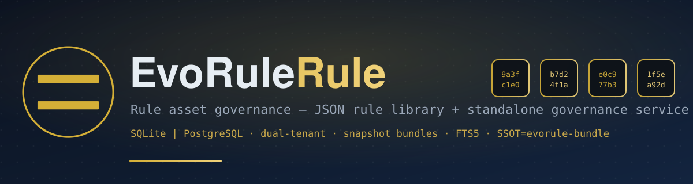

<!--
  Copyright 2026 EvoRule Project

  SPDX-License-Identifier: AGPL-3.0-or-later

  This file is part of EvoRule Rule, licensed under GNU Affero General Public License v3 or later.
-->



<div align="center">

# EvoRule Rule

**Rule asset governance layer — JSON rule library + standalone governance service**

> Complete governance lifecycle for rule assets: datasets → lifecycle → approval publishing → version snapshots → snapshot package exchange → audit traceability

<br>

[](CHANGELOG.md)
[](LICENSE)
[](#testing--verification)
[](https://github.com/tokio-rs/axum)
[](#dual-storage-backends)

**Language / 语言**: [English](#english) · [中文 / Chinese](#chinese)

</div>

---

<a id="english"></a>

## Experience & Navigation

[Quick Start](#quick-start) ·
[Architecture](#architecture) ·
[API Overview](#api-overview) ·
[Core Capabilities](#core-capabilities) ·
[Dual Storage Backends](#dual-storage-backends) ·
[Testing & Verification](#testing--verification) ·
[Roadmap](#roadmap)

---

> ## ✅ v0.3.1 — Released (2026-09-06)
>
> This repo **releases independently**, not tied to other repos' release cadence; version numbers correspond only to this repo's [CHANGELOG](CHANGELOG.md).
>
> **0.3.1**: Governance domain data consistency closure — import/delete chain transactionalized (`import_bundle` single-lock single tx + 10 same-family functions + from-state mis-recording fix); `delete_dataset` snapshot-table cleanup completed; duplicate-create 409 semantics; JWT signing key persistence (restart survives re-login); export evidence shape validation (blocks zero-evidence pass forgery); effectiveness baseline 3-tier pre-validation.
>
> **0.3.0** (2026-09-02): Dual-layer tenant + five-role system; entry query expression (server-side filtering); historical version snapshots persisted + arbitrary-version snapshot package export; dataset-level push event schema declaration; knowledge data asset integration (FTS5 trigram full-text search); CLI import/export subcommands; service directory seed file declaration (multi-plugin aggregation); `/v1/health` liveness probe; full dependency on crates.io stable releases.
>
> **0.2.0** (first public release): Data governance MVP + REST API + auth + LLM client + PostgreSQL schema + key management.
>
> **Version strategy**: Version numbers across ecosystem repos **develop independently, release independently**, not required to match.
>
> This repo is published on [crates.io](https://crates.io/crates/evorule-rule) (lib + dual bins): `cargo add evorule-rule` for the library; `cargo install evorule-rule --bin evorule-rule-serve` for the governance service; `cargo install evorule-rule --bin evorule-rule-cli` for the CLI client. Can also build from source.

---

## One-Liner Positioning

**EvoRule Rule = The "warehouse + governance console" for rule assets.**

The [evorule core repo](https://gitee.com/evorule/evorule) handles rule **execution** (TCB / Reactor / Governance); this repo handles rule **asset management** — storage, versioning, dependency, retrieval, approval publishing, snapshot package exchange, and audit tracing — plus a standalone HTTP governance service and CLI client. **This repo does NOT replace the core repo; rules are ultimately executed by the core engine.**

**Who it's for**:

- Rule engineers who need **versioned storage + approval workflow** for rule assets
- Platform admins who need **multi-tenant / multi-org isolation**
- Integrators who want to plug governance into their own frontend (e.g., [evorule-console-cloud](https://gitee.com/evorule/evorule-console-cloud)'s GovernanceBackend)
- LLM app developers who need **LLM-assisted operations with operation-level audit logging**

---

## Architecture

```
┌────────────────────────────────────────────────────────────────┐
│            evorule-rule-serve process (default 127.0.0.1:18081) │
├────────────────────────────────────────────────────────────────┤
│  axum HTTP + CORS · Bearer auth middleware · Idempotency-Key     │
├────────────────────────────────────────────────────────────────┤
│  api/             auth / datasets / entries / deps / search / bundles │
│  ├── auth          register / login / refresh / logout / me       │
│  ├── orgs          platform/org dual-layer tenant + org mgmt      │
│  ├── datasets      CRUD / publish / version / metadata / eventschema │
│  ├── entries       CRUD / submit-candidate / approve / diff       │
│  ├── deps          dependency read/write + service template reg  │
│  ├── search        dataset / entry search (FTS5 trigram full-text)│
│  ├── bundle        snapshot package export / import / validate   │
│  ├── llm           LLM named-operation proxy + op-level audit    │
│  ├── keys          API key issuance / revocation                  │
│  └── admin/backend self-check (active storage engine + probe results)│
├────────────────────────────────────────────────────────────────┤
│  auth/            JWT dual-generation rotation + jti blacklist + constant-time compare │
│  model/           seven data models + key management (KeyRing dual-gen container) │
│  resolve/         version resolution (auto_by_effective_date / pinned) │
│  validate/        admission gate (same-caliber validation as execution side) │
│  bundle/          snapshot package validation chain (SSOT = crates.io evorule-bundle) │
│  llm_client/      evo-agent serve proxy client                   │
│  cli.rs + bin/    evorule-rule-cli pure REST command-line client  │
├────────────────────────────────────────────────────────────────┤
│  store/           SQLite (default, rusqlite bundled)                │
│                   PostgreSQL (optional, --features postgres + sqlx)  │
├────────────────────────────────────────────────────────────────┤
│  crates.io deps: evorule-bundle 0.3.0 · evorule-hash 0.1.3       │
└────────────────────────────────────────────────────────────────┘
```

**Key constraints**:

- Snapshot package validation chain's **single source of truth is [evorule-bundle](https://crates.io/crates/evorule-bundle)** — this repo and the execution side share the same validation caliber; import/export never has two standards
- Default SQLite active engine; PostgreSQL available as production-grade optional backend (`--features postgres` compile-gated, doesn't drag down default build)
- First-run auto-bootstrap: default tenant + default org + official service directory pre-seeded (idempotent) + JWT signing key randomly generated and persisted (restart preserves token validity; key never printed to logs)

---

## Quick Start

### 1. Build

```bash
git clone https://gitee.com/evorule/evorule-rule.git
cd evorule-rule
cargo build --release
```

Produces two binaries:

| Binary | Role |
|---|---|
| `evorule-rule-serve` | Standalone governance service (REST API) |
| `evorule-rule-cli` | Governance service command-line client (pure REST, no direct DB connection) |

### 2. Start Governance Service

```bash
evorule-rule-serve --db ./data/rule.db --port 18081 \
    --admin-user admin --admin-password <your-admin-password> \
    --allowed-origins "http://localhost:5174"
```

- `--db`: SQLite path (parent dir auto-created; JWT key file lands in same dir)
- `--allowed-origins`: CORS whitelist (not provided = same-origin only)
- First run auto-creates default tenant/org and bootstraps `platform_admin` admin (idempotent)
- PostgreSQL: `cargo build --release --features postgres` + env var `DATABASE_URL`, startup auto smoke-probe gated

### 3. Login for Token

```bash
curl -X POST http://127.0.0.1:18081/v1/auth/login \
  -H "Content-Type: application/json" \
  -d '{"username": "admin", "password": "<your-admin-password>"}'
```

### 4. CLI Operations

```bash
# Auth via environment vars: EVORULE_RULE_URL / EVORULE_RULE_TOKEN
evorule-rule-cli datasets list
evorule-rule-cli datasets export ds-tax-2024 --out bundle.json
evorule-rule-cli datasets import bundle.json
evorule-rule-cli entries bulk-import ./my-dataset --dataset ds-new --tests tests.json
```

CLI import uses `/v1/bundles/import` same validation chain — identical SSOT with API and admission gate.

---

## API Overview

All mounted under `/v1` (except health), **50+ routes**, by functional domain:

| Domain | Representative Endpoints | Notes |
|---|---|---|
| Auth | `POST /v1/auth/register` `/login` `/refresh` `/logout` · `GET /me` | Bearer token + jti blacklist revocation |
| Orgs & Tenants | `/v1/orgs` family | platform/org dual-layer tenant, five roles (viewer / rule_engineer / approver / org_admin / platform_admin) |
| Datasets | `/v1/datasets` CRUD · `POST/{id}/publish` · version/metadata/event-schema | Five-state lifecycle +二次确认 publish + tenant isolation |
| Entries | `/v1/datasets/{id}/entries?filter=` · `/v1/entries/{id}` family | Server-side query expression filtering, submit-candidate / approve, per-version payload, content-level diff |
| Dependencies | `/v1/deps` family | Dependency graph read/write + service template registration / detail / binding |
| Search | `GET /v1/search/datasets` `/search/entries` | Paginated `{items, next_cursor}`; entries FTS5 trigram full-text |
| Snapshot Packages | `POST /v1/bundles/export` `/import` | Export / trim / import / dry-run; `export_bundle_at` supports historical version export |
| LLM | `POST /v1/llm/ops/{operation}` · audit queries | Proxies to evo-agent serve; operation-level audit logged, LLM unreachability reported honestly (never fabricated) |
| Keys | `/v1/api_keys` family + `DELETE /{id}` | Issue / revoke |
| Ops | `GET /v1/health` · `GET /v1/admin/backend` | Health no-auth returns ok/service/version three-key anti-info-leak |

Cross-cutting capabilities: `Idempotency-Key` idempotency middleware (same-key same-payload returns cached / different payload 409 / concurrent in-flight 409), full-chain audit (auth / lifecycle / llm three audit query categories).

---

## Core Capabilities

| Capability | Status | Description |
|---|---|---|
| Dataset & Entry Governance | ✅ | Seven data models (dataset / entry / provenance / dependency / lifecycle / governance / version) |
| Five-State Lifecycle | ✅ | Entry submit-candidate → approve → publish flow, publish requires 二次 confirmation, tenant-isolation guard |
| Version Management | ✅ | Dataset version snapshots persisted + per-version payload endpoints + `export_bundle_at` historical version export |
| Dual-Layer Tenant | ✅ | platform/org two-level + five roles + cross-tenant Public+Published read-only visibility |
| Snapshot Package Exchange | ✅ | Export / trim / import / dry-run; validation chain SSOT = evorule-bundle (crates.io) |
| Content-Addressed | ✅ | Entry content hash snapshots + dedup stats + content-level diff |
| Query Expression | ✅ | EntryFilter server-side filtering (`?filter=`) |
| Full-Text Search | ✅ | knowledge_entries FTS5 trigram index (existing DB idempotent backfill) |
| Auth & Keys | ✅ | JWT dual-generation rotation (active signs / previous fallback) + jti blacklist + KeyRing dual-gen container + HKDF salt-based derivation |
| LLM Named Operations | ✅ | Proxy evo-agent serve, operation-level audit logged, unreachability reported honestly never fabricated |
| Dual Storage Backend | ✅ | SQLite default + PostgreSQL optional (12 core tables real integration tested) |
| Idempotency Protection | ✅ | `Idempotency-Key` middleware |

---

## Dual Storage Backends

| | SQLite (default) | PostgreSQL (optional) |
|---|---|---|
| Enable method | Zero config | `--features postgres` compile + `DATABASE_URL` |
| Positioning | MVP / dev / single-machine | Production-grade |
| Dependency | rusqlite (bundled) — no system sqlite dependency | sqlx (async + migrations embedded, compile-gated, doesn't drag default build) |
| Startup behavior | Opens directly | Smoke-probe gated: create pool + migrations + minimal CRUD round-trip, failure falls back gracefully to SQLite, **never faked** |
| Self-check | — | `GET /v1/admin/backend` real-time reports active backend + probe results |

---

## Testing & Verification

- **128 passed / 0 failed / 2 ignored** (`cargo test --workspace`, default features, measured 2026-09-05)
- **`cargo clippy --workspace --all-targets -- -D warnings` clean** (measured 2026-09-05, 11 lint issues fixed)
- PostgreSQL integration tests require a real PG instance, gated by `--features postgres` (ignored test cases exist for this purpose)
- LLM 3-operation contract acceptance scripts: end-to-end 6 scenarios 26 assertions (`scripts/`)
- Governance-domain acceptance scripts: `scripts/acceptance-governance.ps1`, `scripts/acceptance-llm-ops.ps1`

---

## Documentation

Organized per [Diátaxis](https://diataxis.fr/) framework, see [docs/](docs/introduction.md):

| What you want to do | Where to look |
|---|---|
| First contact, want to get running | [docs/tutorial/](docs/tutorial/) |
| Have a specific problem to solve | [docs/how-to/](docs/how-to/) |
| Look up API / config / commands | [docs/reference/](docs/reference/) |
| Want to understand why it's designed this way | [docs/explanation/](docs/explanation/) |
| Important technical decisions | [docs/adr/](docs/adr/) |
| Build / deploy / ops | [docs/operations/](docs/operations/) |

Full directory listing at [docs/SUMMARY.md](docs/SUMMARY.md) (mdbook render entry point).

---

## Roadmap

- **v0.2** ✅ (2026-08-22): Data governance MVP + REST API + auth + LLM client + PG schema + key management
- **v0.3** ✅ (2026-09-02): Dual-layer tenant five roles + query expression + historical version snapshots + event schema + knowledge assetization + service directory declarative file
- **Next**: Data source binding contract validation (coordinated with evorule-server) · LLM service integration (evo-agent serve wired through) · governance-domain defect fix consolidation into patch versions
- **Later**: Performance baseline · white-label + Dockerization · production-ready evaluation

See [CHANGELOG](CHANGELOG.md) for authoritative status.

---

## License

AGPL-3.0-or-later — consistent with [evorule core repo](https://gitee.com/evorule/evorule).

This repo adopts the EvoRule **dual-license** architecture: AGPL-3.0-or-later for open-source compliance, plus a free commercial exemption (FCL) and a paid commercial license for closed-source use. See [DUAL_LICENSE.md](DUAL_LICENSE.md) for the three-option guide, [FREE_COMMERCIAL_LICENSE.md](FREE_COMMERCIAL_LICENSE.md) (eligible: individuals / <$10M revenue / government / academia / non-profit), and [COMMERCIAL_LICENSE.md](COMMERCIAL_LICENSE.md) (paid). The `core_eval.json` constitution remains **CC0-1.0 public domain**.

Commercial licensing: evorulelab@gmail.com

## Contact

- **Gitee**: <https://gitee.com/evorule/evorule-rule>
- **Organization**: [Gitee @evorule](https://gitee.com/evorule)
- **Email**: evorulelab@gmail.com

---

_This repo is EvoRule ecosystem's data governance layer. Rules do not speak; they only run. We are among the first witnesses._

---

<a id="chinese"></a>

<div align="center">

# EvoRule Rule

**EvoRule 规则资产数据治理层 — JSON 规则资产库 + 独立治理服务**

> 给规则资产配上完整的治理闭环：数据集 → 生命周期 → 审批发布 → 版本快照 → 快照包交换 → 审计溯源

<br>

[](CHANGELOG.md)
[](LICENSE)
[](#测试与验证)
[](https://github.com/tokio-rs/axum)
[](#双存储后端)

[快速开始](#快速开始) ·
[架构](#架构) ·
[API 概览](#api-概览) ·
[核心能力](#核心能力) ·
[双存储后端](#双存储后端) ·
[测试与验证](#测试与验证) ·
[路线图](#路线图)

</div>

---

> ## ✅ v0.3.1 — 已发布 (2026-09-06)
>
> 本仓库**独立 release**，不绑其他仓的发布节奏；版本号只与本仓 [CHANGELOG](CHANGELOG.md) 对应。
>
> **0.3.1**：治理域数据一致性收口——导入/删除链事务化（import_bundle 单锁单事务 + 同族 10 函数 + from-state 误记修复）；delete_dataset 快照表清理补全；重复创建 409 语义；JWT 签名密钥持久化（重启免重登）；export 证据形状校验（封死零证据 pass 伪造）；生效基准三层前置校验。
>
> **0.3.0**（2026-09-02）：双层租户 + 五角色体系；条目查询表达式（服务端过滤）；历史版本快照落库 + 任意版本快照包导出；数据集级 push 事件 schema 声明；knowledge 数据资产化接入（FTS5 trigram 全文检索）；CLI 导入导出子命令；服务目录种子声明文件化（多插件聚合）；`/v1/health` 存活探针；依赖全面走 crates.io 正式版。
>
> **0.2.0**（首次对外发布）：数据治理 MVP + REST API + 认证 + LLM 客户端 + PostgreSQL schema + 密钥管理。
>
> **版本策略**：生态内各仓版本号**独立发展、独立发布**，互不强求一致。
>
> 本仓已发布到 crates.io（lib + 双 bin）：`cargo add evorule-rule` 引入库；`cargo install evorule-rule --bin evorule-rule-serve` 安装治理服务；`cargo install evorule-rule --bin evorule-rule-cli` 安装 CLI。也可从源码构建使用。

---

## 一句话定位

**EvoRule Rule = 规则资产的"库房 + 治理台"。**

[evorule 基础仓](https://gitee.com/evorule/evorule)负责规则的**执行**（TCB / Reactor / Governance）；本仓负责规则的**资产管理**——存储、版本、依赖、检索、审批发布、快照包交换与审计溯源，并提供独立 HTTP 治理服务与 CLI 客户端。**本仓不替代基础仓，规则最终仍由基础仓执行。**

**适合谁用**：

- 需要为规则资产建立**版本化存储 + 审批流**的规则工程师
- 需要多租户 / 多组织隔离的**平台管理员**
- 想把治理能力接进自有前端（如 [evorule-console-cloud](https://gitee.com/evorule/evorule-console-cloud) 的 GovernanceBackend）的**集成商**
- 需要 LLM 辅助操作且要求**操作级审计落库**的 LLM 应用开发者

---

## 架构

```
┌────────────────────────────────────────────────────────────────┐
│            evorule-rule-serve 进程 (默认 127.0.0.1:18081)          │
├────────────────────────────────────────────────────────────────┤
│  axum HTTP + CORS · Bearer 认证中间件 · Idempotency-Key 幂等      │
├────────────────────────────────────────────────────────────────┤
│  api/             认证 / 数据集 / 条目 / 依赖 / 检索 / 快照包     │
│  ├── auth          注册 / 登录 / 刷新 / 登出 / me               │
│  ├── orgs          platform/org 双层租户 + 组织管理              │
│  ├── datasets      CRUD / publish / 版本 / 元数据 / 事件 schema  │
│  ├── entries       CRUD / submit-candidate / approve / diff     │
│  ├── deps          依赖读写 + 服务模板注册与绑定                  │
│  ├── search        数据集 / 条目检索（FTS5 trigram 全文）         │
│  ├── bundle        快照包导出 / 导入 / 校验（SSOT 校验链）        │
│  ├── llm           LLM 命名操作代理 + 操作级审计                  │
│  ├── keys          API 密钥签发与吊销                            │
│  └── admin/backend 后端自检（活跃存储引擎 + 探针结果）            │
├────────────────────────────────────────────────────────────────┤
│  auth/            JWT 双代轮换 + jti 黑名单 + 恒定时间比较        │
│  model/           七大数据模型 + 密钥管理（KeyRing 双代容器）      │
│  resolve/         版本解析（auto_by_effective_date / pinned）     │
│  validate/        入库门禁（与执行侧同口径校验）                   │
│  bundle/          快照包校验链（SSOT = crates.io evorule-bundle） │
│  llm_client/      evo-agent serve 代理客户端                      │
│  cli.rs + bin/    evorule-rule-cli 纯 REST 命令行客户端           │
├────────────────────────────────────────────────────────────────┤
│  store/           SQLite（默认，rusqlite bundled）                │
│                   PostgreSQL（可选，--features postgres + sqlx）  │
├────────────────────────────────────────────────────────────────┤
│  crates.io 依赖：evorule-bundle 0.3.0 · evorule-hash 0.1.3       │
└────────────────────────────────────────────────────────────────┘
```

**关键约束**：

- 快照包校验链的**单一真相源是 [evorule-bundle](https://crates.io/crates/evorule-bundle)**，本仓与执行侧共用同一校验口径，导入/export 不存在两套标准
- 默认 SQLite 活跃引擎；PostgreSQL 为生产级可选后端（`--features postgres` 门控编译，不拖累默认构建）
- 首启自动引导：默认租户 + 默认组织 + 官方服务目录预置（幂等）+ JWT 签名密钥随机生成并持久化（重启 token 保持有效，密钥不打印到日志）

---

## 快速开始

### 1. 编译

```bash
git clone https://gitee.com/evorule/evorule-rule.git
cd evorule-rule
cargo build --release
```

产出两个二进制：

| 二进制 | 角色 |
|---|---|
| `evorule-rule-serve` | 独立治理服务（REST API） |
| `evorule-rule-cli` | 治理服务命令行客户端（纯 REST，不对 db 直连） |

### 2. 启动治理服务

```bash
evorule-rule-serve --db ./data/rule.db --port 18081 \
    --admin-user admin --admin-password <你的管理员密码> \
    --allowed-origins "http://localhost:5174"
```

- `--db`：SQLite 路径（父目录自动创建；JWT 密钥文件落同目录）
- `--allowed-origins`：CORS 白名单（不提供 = 仅同源）
- 首启自动创建默认租户/组织并引导 `platform_admin` 管理员（幂等）
- PostgreSQL：`cargo build --release --features postgres` + 环境变量 `DATABASE_URL`，启动时自动冒烟探针门控

### 3. 登录拿 token

```bash
curl -X POST http://127.0.0.1:18081/v1/auth/login \
  -H "Content-Type: application/json" \
  -d '{"username": "admin", "password": "<你的管理员密码>"}'
```

### 4. CLI 操作

```bash
# 认证走环境变量：EVORULE_RULE_URL / EVORULE_RULE_TOKEN
evorule-rule-cli datasets list
evorule-rule-cli datasets export ds-tax-2024 --out bundle.json
evorule-rule-cli datasets import bundle.json
evorule-rule-cli entries bulk-import ./my-dataset --dataset ds-new --tests tests.json
```

CLI 导入走 `/v1/bundles/import` 同一校验链——与 API、入库门禁**单一 SSOT**。

---

## API 概览

全部挂载于 `/v1`（除 health），共 **50+ 条路由**，按功能域：

| 功能域 | 代表端点 | 说明 |
|---|---|---|
| 认证 | `POST /v1/auth/register` `/login` `/refresh` `/logout` · `GET /me` | Bearer token + jti 黑名单吊销 |
| 组织与租户 | `/v1/orgs` 族 | platform/org 双层租户，五角色（viewer / rule_engineer / approver / org_admin / platform_admin） |
| 数据集 | `/v1/datasets` CRUD · `POST/{id}/publish` · 版本/元数据/事件 schema | 五态生命周期 + 二次确认发布 + 租户隔离 |
| 条目 | `/v1/datasets/{id}/entries?filter=` · `/v1/entries/{id}` 族 | 查询表达式服务端过滤、submit-candidate / approve、逐版本载荷、内容级 diff |
| 依赖 | `/v1/deps` 族 | 依赖图读写 + 服务模板注册 / 详情 / 绑定 |
| 检索 | `GET /v1/search/datasets` `/search/entries` | 分页 `{items, next_cursor}`；条目 FTS5 trigram 全文 |
| 快照包 | `POST /v1/bundles/export` `/import` | 导出/裁剪/导入/预检；`export_bundle_at` 支持历史版本导出 |
| LLM | `POST /v1/llm/ops/{operation}` · 审计查询 | 代理至 evo-agent serve；操作级审计落库，LLM 不可达**如实报错** |
| 密钥 | `/v1/api_keys` 族 + `DELETE /{id}` | 签发 / 吊销 |
| 运维 | `GET /v1/health` · `GET /v1/admin/backend` | health 无鉴权仅回 ok/service/version 三键防状态泄漏 |

横切能力：`Idempotency-Key` 幂等中间件（同 key 同负载返回缓存 / 异负载 409 / 并发在途 409）、全链路审计（auth / lifecycle / llm 三类审计查询）。

---

## 核心能力

| 能力 | 状态 | 说明 |
|---|---|---|
| 数据集与条目治理 | ✅ | 七大数据模型（dataset / entry / provenance / dependency / lifecycle / governance / version） |
| 五态生命周期 | ✅ | 条目 submit-candidate → approve → publish 流转，发布需二次确认，租户隔离守护 |
| 版本管理 | ✅ | dataset 版本快照落库 + 逐版本载荷端点 + `export_bundle_at` 历史版本导出 |
| 双层租户 | ✅ | platform/org 两级 + 五角色 + 跨租户 Public+Published 只读可见 |
| 快照包交换 | ✅ | 导出 / 裁剪 / 导入 / 预检，校验链 SSOT = evorule-bundle（crates.io） |
| 内容寻址 | ✅ | 条目内容哈希快照 + 去重统计 + 内容级 diff |
| 查询表达式 | ✅ | EntryFilter 服务端过滤（`?filter=`） |
| 全文检索 | ✅ | knowledge_entries FTS5 trigram 索引（存量库幂等回填） |
| 认证与密钥 | ✅ | JWT 双代轮换（active 签发 / previous 兜底）+ jti 黑名单 + KeyRing 双代容器 + HKDF 盐基元 |
| LLM 命名操作 | ✅ | 代理 evo-agent serve，操作级审计落库，不可达如实报错不伪造 |
| 双存储后端 | ✅ | SQLite 默认 + PostgreSQL 可选（12 张核心表真实集成测试） |
| 幂等保护 | ✅ | `Idempotency-Key` 中间件 |

---

## 双存储后端

| | SQLite（默认） | PostgreSQL（可选） |
|---|---|---|
| 启用方式 | 零配置 | `--features postgres` 编译 + `DATABASE_URL` |
| 定位 | MVP / 开发 / 单机 | 生产级 |
| 依赖 | rusqlite(bundled)——无系统 sqlite 依赖 | sqlx（异步 + 迁移嵌入，门控编译不拖累默认构建） |
| 启动行为 | 直接打开 | 冒烟探针门控：建池 + 迁移 + 最小 CRUD 往返，失败如实回落 SQLite，**绝不伪造** |
| 自检 | — | `GET /v1/admin/backend` 实时报告活跃后端 + 探针结果 |

---

## 测试与验证

- **128 passed / 0 failed / 2 ignored**（`cargo test --workspace`，默认特性，2026-09-05 实测）
- **`cargo clippy --workspace --all-targets -- -D warnings` 干净**（2026-09-05 实测，已修复 11 处 lint）
- PostgreSQL 集成测试需真实 PG 实例，以 `--features postgres` 门控（ignored 的用例即为此类）
- LLM 三操作契约验收脚本：端到端 6 场景 26 断言（`scripts/`）
- 治理域验收脚本：`scripts/acceptance-governance.ps1`、`scripts/acceptance-llm-ops.ps1`

---

## 文档

按 [Diátaxis](https://diataxis.fr/) 框架组织，详见 [docs/](docs/introduction.md)：

| 你想做什么 | 看哪里 |
|---|---|
| 第一次接触，想跑通 | [docs/tutorial/](docs/tutorial/) |
| 有具体问题要解决 | [docs/how-to/](docs/how-to/) |
| 查 API / 配置 / 命令 | [docs/reference/](docs/reference/) |
| 想理解为什么这么设计 | [docs/explanation/](docs/explanation/) |
| 重要技术决策 | [docs/adr/](docs/adr/) |
| 构建部署运维 | [docs/operations/](docs/operations/) |

完整目录见 [docs/SUMMARY.md](docs/SUMMARY.md)（mdbook 渲染入口）。

---

## 路线图

- **v0.2** ✅ (2026-08-22)：数据治理 MVP + REST API + 认证 + LLM 客户端 + PG schema + 密钥管理
- **v0.3** ✅ (2026-09-02)：双层租户五角色 + 查询表达式 + 历史版本快照 + 事件 schema + knowledge 资产化 + 服务目录声明文件化
- **下一步**：数据源绑定契约校验（与 evorule-server 协同）· LLM 服务化联调（evo-agent serve 打通）· 治理域缺陷修复收口为补丁版本
- **后续**：性能基线 · 白标 + Docker 化 · production-ready 评估

以 [CHANGELOG](CHANGELOG.md) 为准。

---

## 许可证

AGPL-3.0-or-later — 与 [evorule 基础仓](https://gitee.com/evorule/evorule) 一致。

商业许可另议：evorulelab@gmail.com

## 联系方式

- **Gitee**：<https://gitee.com/evorule/evorule-rule>
- **组织**：[Gitee @evorule](https://gitee.com/evorule)
- **邮箱**：evorulelab@gmail.com

---

_本仓是 EvoRule 生态的数据治理层。规则不言语，它们只运行。我们是首批见证者。_
